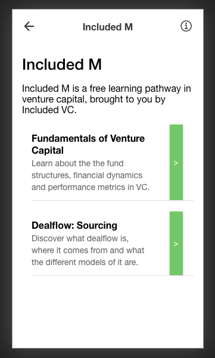
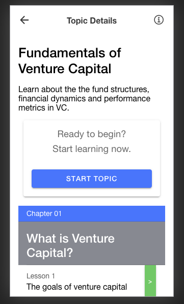
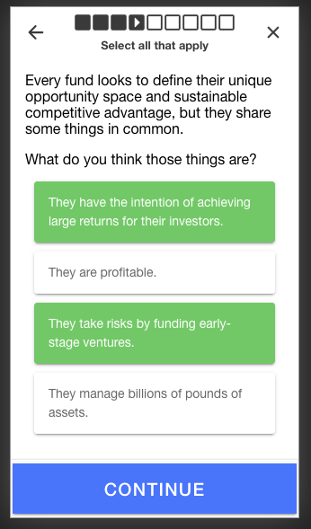

<h1></h1>

# Included M

> _📱 **Try the Included M demo** (best on a mobile browser): [https://included-m.vercel.app](https://included-m.vercel.app)_

**Contents**

- [Included M](#included-m)
  - [Goals](#goals)
  - [Background](#background)
  - [Roadmap](#roadmap)
    - [Content](#content)
    - [Development](#development)
  - [Tech used](#tech-used)
  - [How to contribute](#how-to-contribute)

  
   
  

## Goals

The goals of Included M are:

1. **To improve Fellow experience.** Included has great content (e.g. through 101 packs). Mostly, it's static written content at the moment. What if we could present that content in a more modern way?
2. **To broaden impact beyond Fellows.** Included has had to turn down a lot of people. We can't give them the _full_ Fellow experience, but what if we could give them _something_?
3. **To strengthen the Included brand.** We're re-imagining how people learn venture and enter the industry. What if we had our own product to do that?

Enter [**Included M**](https://included-m.vercel.app): a mobile-first web app that is designed to:

- amplify the reach of Included's content; and
- wrap up that content in engaging, bite-sized chunks.

## Background

Even with the pilot cohort (IVC20), there was always the aspiration to create a learning pathway that went beyond the Fellowship.

This originally had a working title of _Included 1000_.

Now, after a conversation with Stephen and Nikita, I ([Richard](https://richard.ng)) am trying to push this forwards.

I'm drawing heavy inspiration from my experience of [Quantic's mobile-first MBA](https://quantic.edu/), which I think does a pretty good job of making text content come to life through bite-sized and frequent interaction.

> 💡 The _M_ in Included M represents both scale (M is the roman numeral for 1000) and an emphasis on being mobile-optimised.

## Roadmap

There are two parts to Included M: the _platform_ and the _content_.

There's a working version of the core platform (which you can play around with on [the demo](https://included-m.vercel.app)).

It pulls data from a server which provides basic content (which is version-controlled through a [separate repository](https://github.com/richardcrng/included-m-content)).

### Content

Most of the work for Included M is populating content. (If you try the demo, you will see that _most_ content is filler / holding at the moment. As of December 2020, it is only the first lesson of the very first chapter that has _any_ sort of content.)

Content is organised into a sequential hierarchy of:

1. Courses (for now, just one: `main-course`);
2. Topics (e.g. `main-course/fundamentals` and `maincourse-/dealflow`)
3. Chapters (e.g. `main-course/fundamentals/what-is-venture`)
4. Lessons (e.g. `main-course/fundamentals/what-is-venture/goals-of-venture`)

### Development

There is some further platform development work to be carried out as well (e.g. creation of user accounts, saving of user progress, possibly introducing something like [spaced repetition](https://en.wikipedia.org/wiki/Spaced_repetition)).

## Tech used

- React
- TypeScript
- [Riduce](https://github.com/richardcrng/riduce)
- Ionic
- Styled Components
- Vercel

## How to contribute

You can:

- **Produce / adapt content** (takes a _small_ amount of coding, but accessible and learnable)
- **Test it out** and report bugs / unexpected behaviour
- **Contribute to the web app** (React and TypeScript experience ideal, but I can teach bits)
